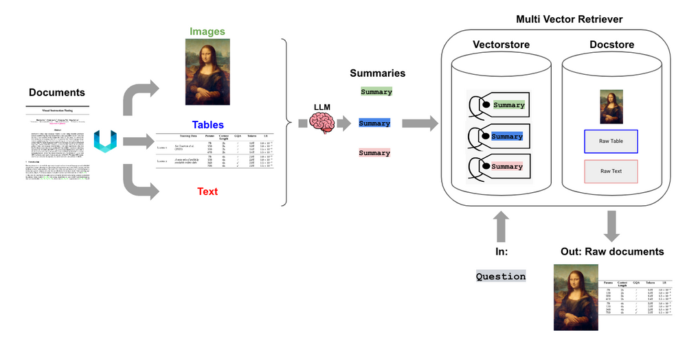

# 🚀 **Multi-modal RAG System** 🚀

A **Multi-modal Retrieval-Augmented Generation (RAG) System** that processes **text, tables, and images** to provide relevant information. This system is designed to handle diverse document types and retrieve not just text but also **relevant images and tables** based on the input query.  

### **Key Components**  
Here’s what powers the system:  
- **Gemini**: Llm engine
- **LangChain**: To build modular RAG pipelines.  
- **Unstructured-IO**: For processing & parcing various document formats.  

The system extracts and summarizes content from documents, then uses a **multi-vector retriever** to fetch the most relevant information, ensuring the response includes the appropriate context from the document.  

### **Why It’s Useful**  
This system is particularly helpful for:  
✅ **Handling queries** that involve multiple data types.  
✅ **Providing richer responses** by including relevant images and tables.  
✅ **Applications in industries** like healthcare, finance, and education, where data is often multimodal.  

### **Challenges & Learnings**  
Building this system involved addressing challenges like computational complexity and integrating different modalities. It’s been a great learning experience and has opened up new areas for exploration.  

Looking forward to connecting and exploring new opportunities!  

---  
**Author:** Sif Eddine Boudjellal  
**LinkedIn:** [LinkedIn](https://www.linkedin.com/in/sif-eddine-boudjellal/)
